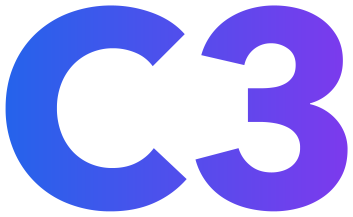

<h1 style="font-size: 36px">C3-Web</h1>

The C3 Website made with [Astro](https://astro.build/), [TailwindCSS](https://tailwindcss.com/) and [Starlight](https://starlight.astro.build/).

<h1 style="font-size: 24px;">Get Started</h1>

After cloning the repository with `git clone`, you need to run:
- `npm install`
- `npm run dev`

<h1 style="display: flex; align-items: center; font-size: 24px;">Project Structure</h1>
  
```
📦c3
 ┣ 📂public
 ┣ 📂src
 ┃ ┣ 📂components
 ┃ ┣ 📂content
 ┃ ┃ ┣ 📂docs
 ┃ ┃ ┃ ┗ 📂guide
 ┃ ┃ ┗ 📜config.js
 ┃ ┣ 📂pages
 ┃ ┃ ┗ 📜index.astro
 ┃ ┗ 📜env.d.ts
 ┣ 📜.gitignore
 ┣ 📜astro.config.mjs
 ┣ 📜package.json
 ┣ 📜tailwind.config.cjs
 ┗ 📜tsconfig.json
```

# Contribution

If you want to contribute to this project, you can do so by forking this repository and creating a pull request.

## Adding Documentation content
Navigate to one of the following folders:
`src/content/docs/guide`
or 
`src/content/docs/references`

create a file ending in `.mdx` (or `.md`) (or edit one that already exists)

and lastly add a little bit of a header on top of whatever markdown content you have, one that looks like this (for SEO and visibility on the website)
```astro
---
title: the C3 Handbook
description: A guide to the C3 Programming Language
---
and after the `---` everything else is just plain old markdown!
```

Please visit the [Starlight Docs](https://starlight.astro.build/) for more info.
