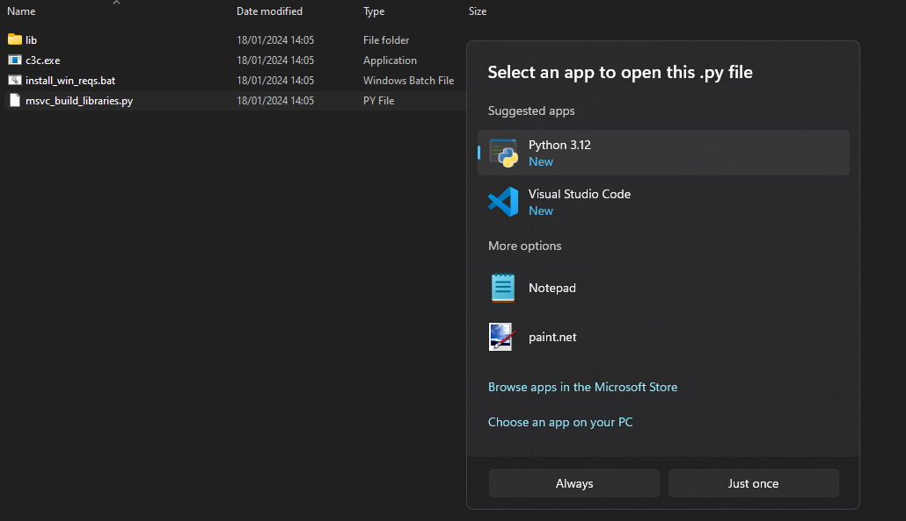

import Link from "../../../components/link.astro"


# Prebuilt binaries
- [Installing on Windows](#installing-on-windows)
- [Installing on Mac Arm64](#installing-on-mac-arm64)
- [Installing on Ubuntu](#installing-on-ubuntu)
- [Installing on Debian](#installing-on-debian) 
- [Installing on Arch](#installing-on-arch-linux) 

## Installing on Windows
1. <Link os="windows" extension="zip" /> 
2. Unzip it into a folder
3. Either Visual Studio 17 or follow the next two steps.
4. Run the `msvc_build_libraries.py` Python script which will download the necessary files to compile on Windows.

:::note[Running the Python script]

If you don't have Python installed, you can download it from [the Python Website](https://www.python.org/downloads/).
or get it from the [the Microsoft Store](https://www.microsoft.com/en-us/p/python-39/9p7qfqmjrfp7)

Afterwards you can double click the `msvc_build_libraries.py` file and pick "python" from the list of programs in the "Select an app to open this .py file" window.


:::

### Optional: set c3c as a global environment variable

5. copy the folder
6. navigate to `C:\Program Files`
7. paste the folder here
8. navigate inside the folder you've pasted
9. copy the path of the folder
10. search for "edit the system environment variables" on your computer
11. click on the "environment variables" button on the bottom right
12. under "user variables" double click on "path"
13. click on "new" and paste the path to the folder
14. run `c3c` on anywhere in your computer!
```bash
c3c compile ./hello.c3
```

## Installing on Mac Arm64
1. Make sure you have XCode with command line tools installed.
2. <Link os="macos" extension="zip" />
3. Unzip executable and standard lib.
4. Run `./c3c`.


## Installing on Ubuntu
1. <Link os="ubuntu-22" extension="tar.gz" />
2. Unpack executable and standard lib.
3. Run `./c3c`.

## Installing on Debian
1. <Link os="linux" extension="tar.gz" />
2. Unpack executable and standard lib.
3. Run `./c3c`.

## Installing on Arch Linux
There is an AUR package for the c3c compiler : [c3c-git](https://aur.archlinux.org/packages/c3c-git).

You can use your AUR package manager:
```bash
paru -S c3c-git
# or yay -S c3c-git
# or aura -A c3c-git
```

Or clone it manually:
```bash
git clone https://aur.archlinux.org/c3c-git.git
cd c3c-git
makepkg -si
```

## Troubleshooting

**Note:** If you get an error like `No module named 'std::io' could be found`, you may need to set the `C3C_LIB` environment variable to point to the standard library location:

**Bash/Zsh:**
```bash
export C3C_LIB=/path/to/c3c/lib
```

**Fish:**
```fish
set -gx C3C_LIB /path/to/c3c/lib
```

**Windows (PowerShell):**
```powershell
$env:C3C_LIB = "C:\path\to\c3c\lib"
```
