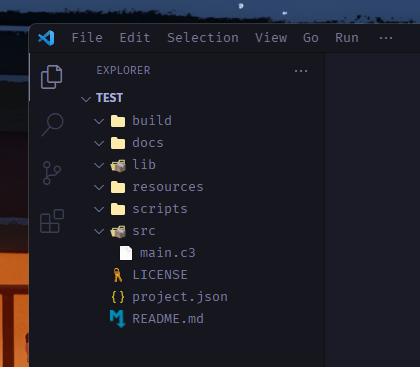

:::note[Not installed the C3 compiler yet?]
[Download C3](/install-c3/prebuilt-binaries/), available on Mac, Windows and Linux.
:::

## Projects in C3
Projects are *optional*, but are a good way to manage compiling code when there
 are a lot of files and modules.

### Creating a new project

The `c3c init` command will create a new directory containing your project structure.

```bash
c3c init <project-name>
```

### Project structure

If you check the directory that was created you might find it a bit confusing with a bunch of different directories, but worry not because if you expand them you will realise that most of them are actually empty!



Let's go over some of the useful ones;
- `./build` is where your temporary files will end up,
- `./docs` are the overall documentations for your code,
- `./lib` is where C3 libraries (with the .c3l suffix) end up
- `./resources` are for any resources like images, sound effects etc.
- `./scripts` is for various scripts, including .c3 scripts that can run at compile time to generate code
- The `./src` folder is what we care about as it's where a majority of our code will go.
- And lastly the project.json file is where you add more data about your project, sort of like package.json for node.js

If you need more detail later on check [C3 project build commands](/build-your-project/build-commands/) and [C3 project configuration](/build-your-project/project-config/) to learn more.


