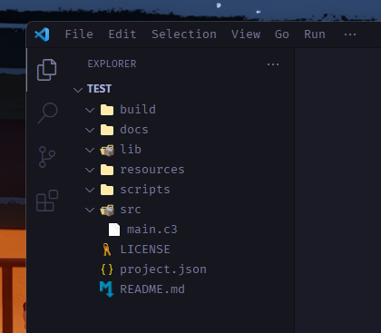

Let's create our first C3 project. We will create a simple calculator app that will add two numbers.

But before that we need to install C3C, the compiler for C3. 

:::note[Haven't installed C3C yet?]
You can follow [this link](references/getting-started/prebuilt-binaries/) to install the compiler on Mac, Windows and Linux.
:::
## Creating a new project

The `c3c init` comamnd will create a new directory containing your project structure.

```bash
$ c3c init <project-name>
```

## Project structure

If you check the directory that was created you might find it a bit confusing with a bunch of different directories but worry not because if you expand them you will realise that most of them are actually empty!



Let's go over some of the useful ones;
- `./build` is where your temporary files will end up,
- `./docs` are the overall documentations for your code,
- `./lib` is where C3 libraries (with the .c3l suffix) end up
- `./resources` are for any resources like images, sound effects etc.
- `./scripts` is for various scripts, including .c3 scripts that can run at compile time to generate code
- The `./src` folder is what we care about as it's where a majority of our code will go.
- And lastly the project.json file is where you add more data about your project, sort of like package.json for node.js

For now we can ignore all of these and jump into `src/main.c3`